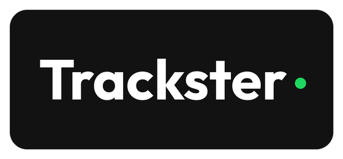

<p align="center">
  
</p>

<h1 align="center">Trackster</h1>

<p align="center">
  Expense tracking that reads your bank emails so you don't have to.
</p>

<p align="center">
  <a href="https://track.trackster.my.id"><strong>Open app</strong></a>
  &nbsp;|&nbsp;
  <a href="https://api.track.trackster.my.id">API</a>
</p>

---

Trackster watches Gmail for BCA, Jago, and Flip receipts, turns them into expenses, and keeps a daily budget with Telegram alerts when you go over. Built for one person, run on your own VPS.

## Features

- **Bank email sync** — BCA, Jago, and Flip notifications become transactions automatically
- **Daily budget** — see today's spend vs limit, with Telegram alerts when you blow it
- **Balances** — live BCA / Jago balances that move with each expense and income
- **Income & subscriptions** — manual income, recurring bills, Google Calendar reminders
- **Reports** — today, weekly, insights, and monthly-style summaries
- **Goals** — savings goals with contributions
- **Split bill** — scan a receipt, assign items, share a link
- **Tanya AI** — ask about your spending in chat or Telegram

## Stack

| Layer | Tech |
| --- | --- |
| Frontend | Next.js 14, Tailwind, SWR |
| Backend | NestJS, Prisma, PostgreSQL |
| Auth | JWT in httpOnly cookie |
| Sync | Gmail API |
| Alerts | Telegram bot |
| Deploy | Docker Compose, Nginx, Let's Encrypt, GitHub Actions to VPS |

## Quick start

```bash
cp .env.example .env
# fill in credentials — comments in the file explain each var

docker compose up -d postgres

cd apps/backend
npm install
npx prisma migrate dev
npx prisma db seed

cd ../frontend
npm install
```

Run both apps:

```bash
# terminal 1
cd apps/backend && npm run start:dev   # http://localhost:4000

# terminal 2
cd apps/frontend && npm run dev        # http://localhost:3000
```

Default login: username `admin`, password from `ADMIN_PASSWORD` in `.env`. Change it after first login.

Connect Gmail from **Settings** in the app (OAuth). Telegram bot token and chat ID are also set there.

## Production

```bash
docker compose -f docker-compose.prod.yml up -d --build
```

Requires a filled `.env` on the server and Nginx + TLS under `nginx/`. Pushing to `main` triggers CD (build backend, then frontend, then restart).

After first deploy, seed once if needed:

```bash
docker compose -f docker-compose.prod.yml exec backend npx prisma db seed
```

New env vars are not applied by git — edit `.env` on the VPS and restart the containers.

## Repo map

```
apps/backend   NestJS API + Gmail parsers
apps/frontend  Next.js app
nginx/         reverse proxy + SSL helpers
design_system/ UI tokens and handoff notes
```

Deeper architecture notes live in `CLAUDE.md` and `TRACKSTER_BUILD_PLAN.md`.
