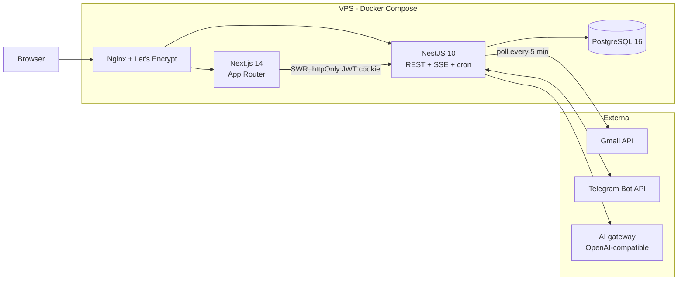

<p align="center">
  
</p>

<h1 align="center">Trackster</h1>

<p align="center">
  Personal finance platform that turns bank notification emails into a live budget, balances, reports, and an AI advisor.
</p>

<p align="center">
  <a href="https://github.com/ArzakaRaffan/trackster/actions/workflows/deploy.yml"></a>
  
  
  
  
  
</p>

<p align="center">
  <a href="https://track.trackster.my.id"><strong>Live app</strong></a>
  &nbsp;·&nbsp;
  <a href="#architecture">Architecture</a>
  &nbsp;·&nbsp;
  <a href="#getting-started">Getting started</a>
  &nbsp;·&nbsp;
  <a href="#documentation">Documentation</a>
</p>

---

## Table of contents

- [Overview](#overview)
- [Capabilities](#capabilities)
- [Architecture](#architecture)
- [Tech stack](#tech-stack)
- [Getting started](#getting-started)
- [Configuration](#configuration)
- [Quality checks](#quality-checks)
- [Deployment](#deployment)
- [Security model](#security-model)
- [Repository layout](#repository-layout)
- [Documentation](#documentation)
- [Project status](#project-status)
- [License](#license)

## Overview

Trackster ingests transaction notification emails from BCA, Jago, and Flip through the Gmail API, parses them into expenses and income, and keeps balances, daily budgets, and reports in sync without manual entry. A Telegram bot delivers alerts and check-ins, and an AI advisor answers questions against the user's own financial data.

It is a **single-tenant system by design**: one owner, no signup flow, no multi-tenancy. Every feature is scoped to that one account, which keeps the data model and the security surface small.

## Capabilities

| Area | What it does |
| --- | --- |
| **Automatic capture** | Gmail sync every 5 minutes. HTML parsers for BCA (transfers, virtual accounts), Jago (transfers, incoming money), and Flip (receipts). Deduplicated by Gmail message ID. Every parse outcome is logged for audit. |
| **Balances** | Live, incremental per-account balances (BCA, Jago). They move with each expense and income inside a single database transaction. Manual corrections are recorded as adjustments. |
| **Budgeting** | Daily budget per weekday, optional carry-over of unspent budget within the week, weekly 50/30/20 allocation from confirmed income, and AI-assisted budget suggestions. |
| **Income** | Income streams (fixed, per-session, variable, deduction-based, irregular), forecast with conservative / expected / maximum scenarios, weekly check-in via web and Telegram, and email-based capture. |
| **Reports and analytics** | Period statistics with a comparison period, routine vs. one-off spending, anomaly detection, habits, time heatmap, frozen weekly and monthly report snapshots, 6-month and all-time views. |
| **AI advisor ("Tanya Track")** | Streaming chat with persistent threads, long-term memory, full-text retrieval over past chats and reports, simulation tools (savings plans, what-if purchases), and the same advisor on Telegram. All figures come from deterministic code; the model only selects and explains. |
| **Goals, subscriptions, reimbursements** | Savings pockets with contribution tracking, recurring bills with Google Calendar reminders, and shared-expense reimbursement tracking with net vs. gross views. |
| **Public tools** | Split Bill (receipt scan, proportional tax, shareable link), Trip settle-up, savings calculator, and installment / PayLater calculator. These are isolated from private financial data. |

## Architecture


```mermaid
flowchart LR
  subgraph External
    GM[Gmail API]
    TG[Telegram Bot API]
    AI[AI gateway<br/>OpenAI-compatible]
  end

  subgraph VPS["VPS - Docker Compose"]
    NX[Nginx + Let's Encrypt]
    FE[Next.js 14<br/>App Router]
    BE[NestJS 10<br/>REST + SSE + cron]
    DB[(PostgreSQL 16)]
  end

  U[Browser] --> NX
  NX --> FE
  NX --> BE
  FE -- "SWR, httpOnly JWT cookie" --> BE
  BE --> DB
  BE -- "poll every 5 min" --> GM
  BE <--> TG
  BE --> AI
```

**Key design rules**

- **One feature, one NestJS module** under `apps/backend/src/modules/`: module, controller, service, and DTOs where validation is needed.
- **Balances are never recomputed from aggregates.** They move only through `BalanceService.adjustBalance()` inside the same Prisma transaction as the operation that caused the change. A baseline rule prevents backfilled history from double-counting against a manual correction.
- **Single source of truth for statistics.** `AnalyticsService.getPeriodStats()` feeds the Analysis page, reports, budget adherence, AI cards, and the health score.
- **Deterministic numbers, generative narrative.** The LLM never calculates displayed figures.
- **WIB time boundaries everywhere.** Day, week (Monday to Sunday), and month boundaries use shared helpers instead of server-local time.

## Tech stack

| Layer | Technology |
| --- | --- |
| Frontend | Next.js 14 (App Router), React 18, Tailwind CSS, SWR, Recharts, Motion |
| Backend | NestJS 10, Prisma 5, `@nestjs/schedule` for cron |
| Database | PostgreSQL 16 (full-text search with the `indonesian` dictionary) |
| Auth | Username and password (bcrypt), JWT in an httpOnly cookie |
| Integrations | Gmail API (OAuth2), Telegram Bot API, OpenAI-compatible AI gateway |
| Delivery | Docker Compose, Nginx, Let's Encrypt, GitHub Actions, GHCR |

## Getting started

**Prerequisites:** Node.js 20, Docker with Compose, a Google Cloud OAuth client (Gmail API and Calendar API enabled).

```bash
cp .env.example .env           # then fill in credentials, see Configuration

# Database (host port 5434)
docker compose -p trackster-dev up -d postgres

# Backend
cd apps/backend
npm install
npx prisma migrate dev
npx prisma db seed
npm run start:dev              # http://localhost:4000

# Frontend, in a second terminal
cd apps/frontend
npm install
npm run dev                    # http://localhost:3000
```

Sign in with `ADMIN_USERNAME` and `ADMIN_PASSWORD` from `.env`. Connect Gmail and the Telegram bot from **Settings** inside the app; those credentials are stored in the database, not in `.env`.

> **Running on a shared host?** Read [`CAUTION.md`](CAUTION.md) first. Always pass `-p trackster-dev` to Compose for the dev database, and cap Node memory (`NODE_OPTIONS=--max-old-space-size=1536`) for builds. The development compose file shares a project name and volume with production.

## Configuration

Copy `.env.example` and fill in the values. The main groups:

| Group | Variables |
| --- | --- |
| Database | `DATABASE_URL`, `POSTGRES_PASSWORD` |
| Auth | `JWT_SECRET`, `ADMIN_USERNAME`, `ADMIN_PASSWORD`, `COOKIE_DOMAIN` (production) |
| Owner identity | `OWNER_FULL_NAME`, `OWNER_ACCOUNT_NUMBERS`. Used by parsers to classify transfers to the owner's own accounts as internal. |
| Gmail | `GMAIL_CLIENT_ID`, `GMAIL_CLIENT_SECRET`, `GMAIL_REDIRECT_URI` |
| AI | `AI_BASE_URL`, `AI_API_KEY`, `AI_MODEL`, `AI_MODEL_FAST`, `SPLITBILL_AI_*` |
| URLs | `FRONTEND_URL`, `NEXT_PUBLIC_API_URL`, `NEXT_PUBLIC_SITE_URL`, `BACKEND_PORT` |

`NEXT_PUBLIC_*` values are baked into the frontend image at build time. In production the server `.env` is managed by hand and is intentionally not part of the repository or the CD pipeline.

## Quality checks

```bash
# Backend: type check without emitting (memory-capped)
cd apps/backend && NODE_OPTIONS=--max-old-space-size=1536 npx tsc --noEmit -p tsconfig.json

# Frontend: type check
cd apps/frontend && npx tsc --noEmit

# Self-checks: pure-logic assertions, no database required
cd apps/backend  && npx ts-node src/modules/<module>/<name>.check.ts
cd apps/frontend && npx tsx    src/lib/<name>.check.ts
```

Parser fixtures are real bank emails stored under `apps/backend/src/modules/gmail/parsers/__fixtures__/`. Update them whenever a bank changes its email format. Before reporting a change as done, build both apps and verify the behavior in a running browser session, not only at compile time.

## Deployment

Delivery is fully automated on every push to `main` (`.github/workflows/deploy.yml`):

1. **Build** runs on a GitHub runner and pushes `trackster-backend` and `trackster-frontend` images to GHCR, tagged `latest` and with the commit SHA.
2. **Deploy** connects to the VPS over SSH, syncs the compose and Nginx files, runs `docker compose pull`, then `up -d`. The VPS builds nothing.

Database migrations apply automatically when the backend container starts (`prisma migrate deploy`). Seeding is a one-time manual step:

```bash
docker compose -f docker-compose.prod.yml exec backend npx prisma db seed
```

**Rollback** to any previous build:

```bash
IMAGE_TAG=<commit-sha> docker compose -f docker-compose.prod.yml up -d
```

The VPS needs a one-time `docker login ghcr.io` using a classic personal access token with `read:packages`. New environment variables must be added to the server `.env` manually, followed by `docker compose up -d`. TLS certificates are issued once through `init-letsencrypt.sh`.

## Security model

- Single owner account; no registration endpoint exists.
- Session is a JWT in an httpOnly cookie scoped to the parent domain, and the frontend middleware gates every private route.
- The Telegram webhook is public but validates a secret path segment and the configured chat ID.
- Split Bill separates a read-only `publicSlug` from a management `ownerToken` so participants cannot edit assignments. Public creation endpoints are rate limited.
- Split Bill and the public calculators never read or write transactions or balances.
- Secrets live in the server `.env` or in the database, never in git.

## Repository layout

```
apps/
  backend/          NestJS API, Prisma schema and migrations, Gmail parsers, cron jobs
  frontend/         Next.js application (private /app area + public tools)
nginx/              Reverse proxy vhosts and SSL helpers
design_system/      Design tokens, guidelines, and handoff notes
docs/
  context/          Overview, architecture, decisions (ADR log), gotchas, codemap
  revamp/           Revamp v2 roadmap, per-epic specs, and live status
.github/workflows/  CI/CD pipeline
docker-compose.yml        Local development (Postgres)
docker-compose.prod.yml   Production stack
```

## Documentation

| Document | Purpose |
| --- | --- |
| [`docs/context/_Overview.md`](docs/context/_Overview.md) | What the system is and how to run it |
| [`docs/context/Architecture.md`](docs/context/Architecture.md) | Modules, data flow, schema, system boundaries |
| [`docs/context/Decisions.md`](docs/context/Decisions.md) | Architecture decision log with dates and rationale |
| [`docs/context/Gotchas.md`](docs/context/Gotchas.md) | Known pitfalls and their fixes |
| [`docs/context/Codemap.md`](docs/context/Codemap.md) | Where to look to change a given feature |
| [`docs/context/Product.md`](docs/context/Product.md) | Product intent and the real-world money flow |
| [`docs/revamp/README.md`](docs/revamp/README.md) | Revamp v2 index, status table, and remaining work |
| [`CAUTION.md`](CAUTION.md) | Resource limits and safe-operation checklist for the shared VPS |
| [`CLAUDE.md`](CLAUDE.md) | Project conventions and domain rules (parsers, balances) |

## Project status

Revamp v2 (started 2026-09-24) covers parser correctness, the income model, the AI advisor, analytics, reports, budget advice, the mascot, and public tools. All planned sessions are implemented; the remaining work is browser and Telegram verification. Live status is tracked in [`docs/revamp/README.md`](docs/revamp/README.md).

## License

Private project. No open-source license is granted; all rights reserved.
