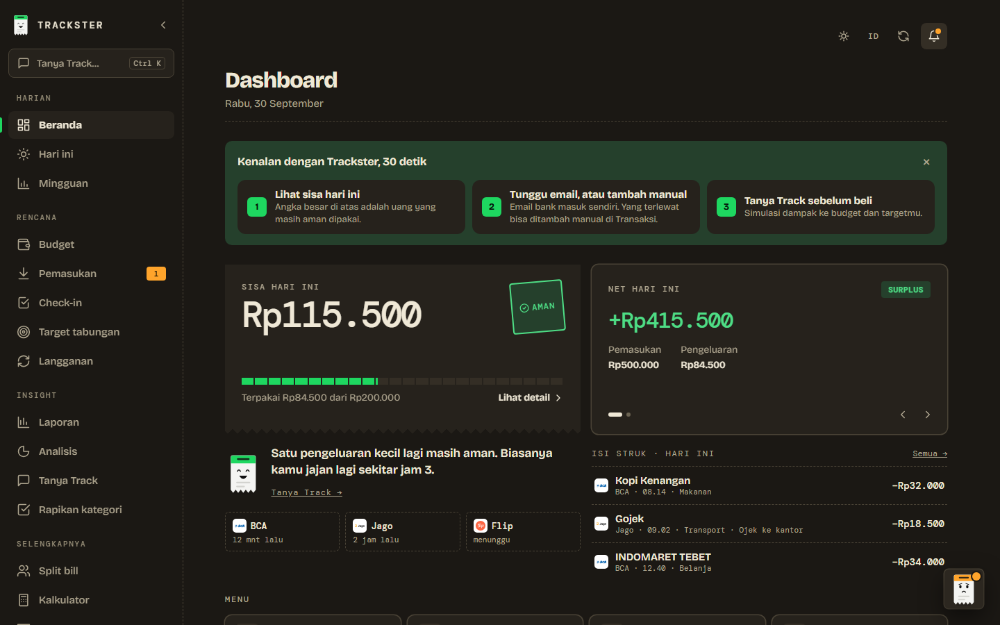
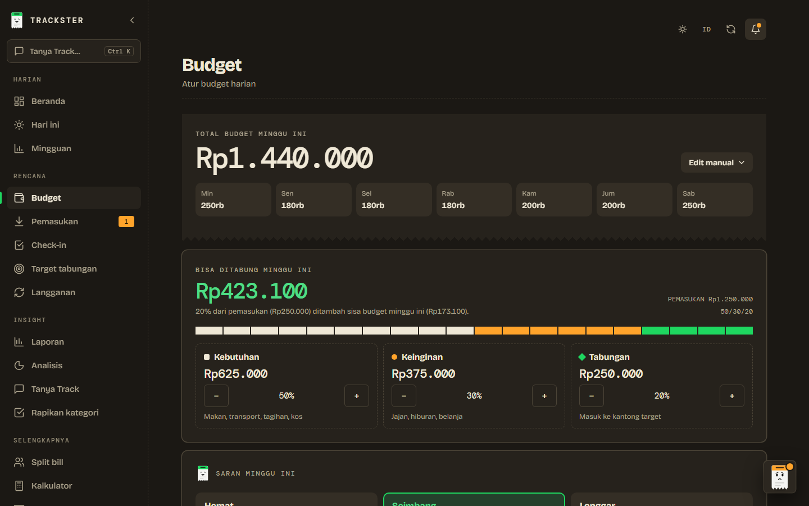
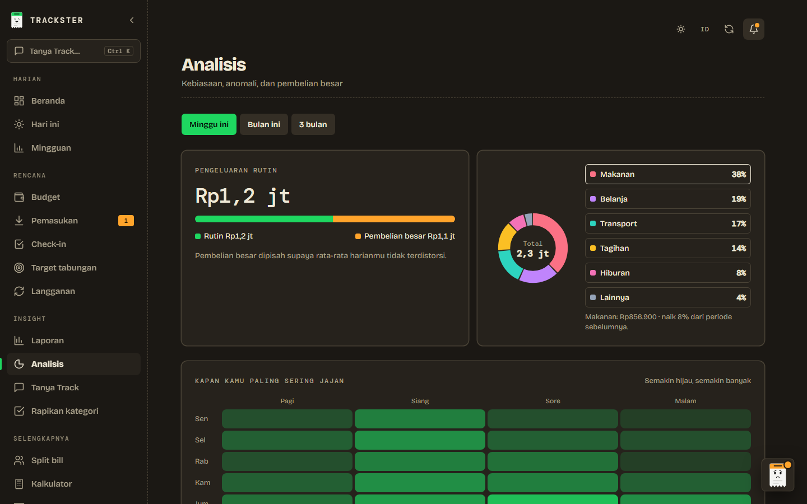
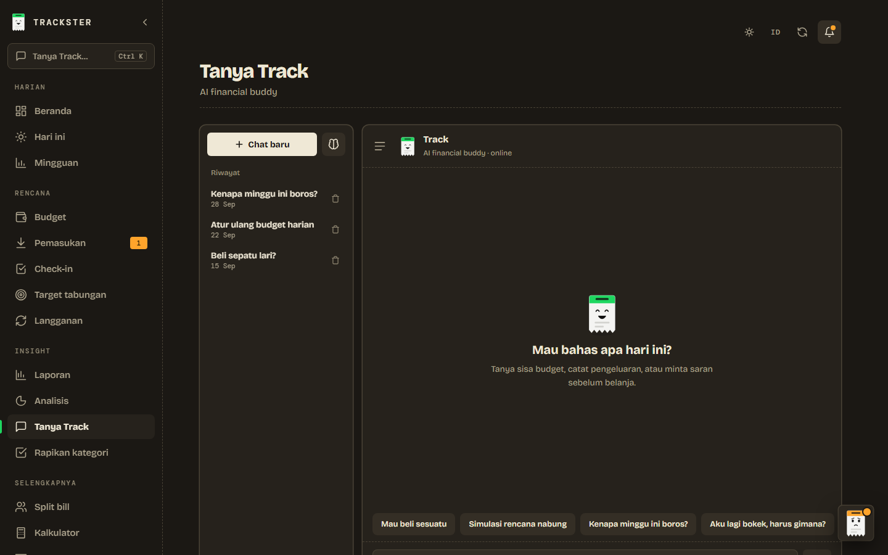
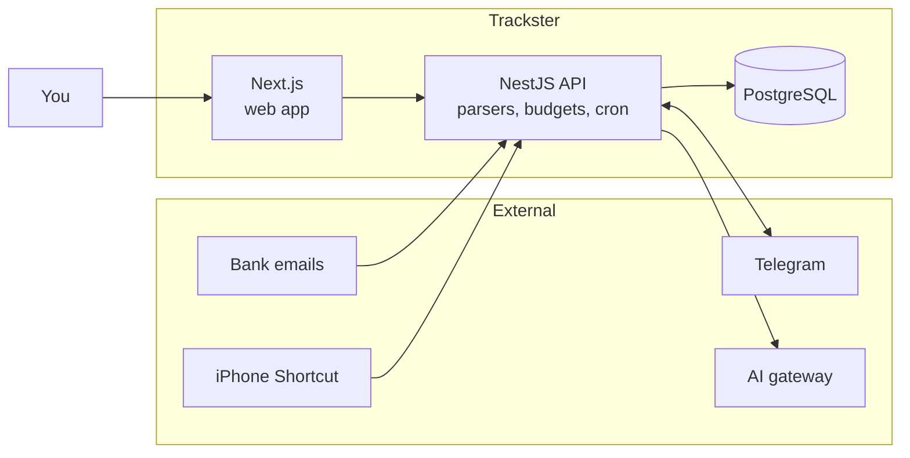

  

<h1 align="center">Trackster</h1>

  Personal finance that fills itself in. Bank notification emails become a live budget, balances, reports, and an AI advisor that knows your numbers.

  
  
  
  
  
  

  <a href="https://trackster.dev"><strong>Live app</strong></a>
  &nbsp;·&nbsp;
  <a href="https://trackster.dev/demo"><strong>Try the demo</strong></a>
  &nbsp;·&nbsp;
  <a href="#what-it-does">Features</a>
  &nbsp;·&nbsp;
  <a href="#how-it-works">How it works</a>

  

---

## The idea

Most expense trackers die the same way: you stop typing things in. Trackster removes the typing. When your bank sends a notification, Trackster reads it, files it under the right category, moves the right balance, and tells you what is still safe to spend today.

The product has one question at its center, **"how much can I still spend today?"**, and everything else exists to answer it honestly.

## What it does

| | |
| --- | --- |
| **Automatic capture** | Parses BCA, Jago, and Flip notification emails into expenses and income. No typing, no duplicates, and transfers between your own accounts are recognized and kept out of your spending. |
| **Quick add anywhere** | Log a payment from an iPhone Shortcut in two taps, using a personal API token you can revoke at any time. Safe to retry: a repeated request never double-counts. |
| **Live balances** | Per-account balances (BCA, Jago) that move the moment money does, and stay consistent even when something fails halfway. |
| **Daily budget** | A budget for each weekday, optional carry-over of what you did not spend, and a weekly 50/30/20 split built from the income you have actually confirmed. |
| **Income that is not a salary** | Fixed pay, per-session pay, irregular income. Forecasts come in conservative, expected, and maximum scenarios, with a weekly check-in on the web and in Telegram. |
| **Analysis and reports** | Routine spending separated from one-off big purchases, a heatmap of when you spend, anomaly detection, and frozen weekly and monthly report snapshots. |
| **Tanya Track, the AI advisor** | Chat that remembers you, searches your past conversations, and simulates decisions ("what if I buy this?", "can I afford this plan?"). It explains the numbers; it never invents them. |
| **Goals, subscriptions, reimbursements** | Savings pockets, recurring bills with reminders, and tracking for money other people owe you. |
| **Public tools** | Split Bill with receipt scanning and a shareable link, Trip settle-up, savings and installment calculators. No account needed. |

<table>
  <tr>
    <td width="50%"></td>
    <td width="50%"></td>
  </tr>
  <tr>
    <td align="center">Budget: weekly allocation, per-day limits, and what is safe to spend</td>
    <td align="center">Analysis: where the money goes, and when</td>
  </tr>
</table>

  
   
  Tanya Track: an advisor that answers from your real numbers

*Screenshots are the public demo, which uses sample data.*

## How it works

```mermaid
flowchart LR
  subgraph External
    EM[Bank emails]
    TG[Telegram]
    AI[AI gateway]
    IP[iPhone Shortcut]
  end

  subgraph Trackster
    FE[Next.js<br/>web app]
    BE[NestJS API<br/>parsers, budgets, cron]
    DB[(PostgreSQL)]
  end

  U[You] --> FE
  FE --> BE
  EM --> BE
  IP --> BE
  BE <--> TG
  BE --> AI
  BE --> DB
```

A few rules the system is built around:

- **Balances are never recomputed from totals.** They move only inside the same database transaction as the event that caused them, so a balance can never disagree with its history.
- **Deterministic numbers, generative narrative.** Every figure on screen comes from plain code. The AI only picks what to look at and explains it.
- **One source of truth for statistics.** The analysis page, reports, budget adherence, AI cards, and the health score all read from the same calculation.
- **Isolation by default.** Every record belongs to exactly one user, and every query is scoped to them. Tenant isolation is covered by automated end-to-end tests.
- **Private tools stay private.** Split Bill and the calculators never touch anyone's transactions or balances.

## Built with

| Layer | Technology |
| --- | --- |
| Frontend | Next.js 14 (App Router), React 18, Tailwind CSS, SWR, Recharts |
| Backend | NestJS 10, Prisma 5, scheduled jobs for sync, alerts, and reports |
| Database | PostgreSQL 16, with full-text search in Indonesian |
| Integrations | Telegram Bot API, an OpenAI-compatible AI gateway, Google Calendar |
| Delivery | Docker, GitHub Actions, GHCR, automatic deploys on every release |

## Status

Live and in daily use. Access is by invitation.

## License

Private project. No open-source license is granted; all rights reserved.
