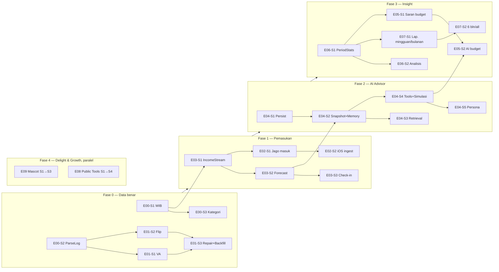

# Roadmap Revamp v2

## Prinsip urutan

1. **Data benar dulu, fitur pintar belakangan.** AI advisor, analisis, dan laporan cuma sebagus datanya.
   Saat ini ada transaksi yang hilang (VA), dobel (Flip), salah hari (timezone UTC), 39% nyasar ke
   `LAINNYA`, dan pemasukan berhenti dicatat sejak 24 Agustus. Kalau langsung bikin AI pintar di atas
   data ini, hasilnya pintar-tapi-salah. → **Fase 0 wajib duluan.**
2. **Pemasukan adalah tulang punggung.** Saran budget (#9), goal/simulasi (#3, #4), savings rate di
   laporan (#7) semuanya butuh model pemasukan. → **Fase 1 sebelum AI & insight.**
3. **AI core sekali bangun, dipakai di mana-mana.** Persistensi + memory + snapshot + simulasi dibangun
   di E04, lalu Budget Advisor, Laporan, dan mascot tinggal pakai.
4. **Satu service statistik untuk Analisis & Laporan** (E06-S1) — jangan dua query agregat berbeda yang
   hasilnya bisa beda angka.
5. **Mascot & fitur publik independen** — bisa dikerjain paralel kapan saja karena nggak nyentuh data inti.

## Fase

| Fase | Isi | Kenapa di sini | Estimasi |
|---|---|---|---|
| 0 | E00 + E01 | Semua fitur di atasnya baca data ini | 6 sesi |
| 1 | E03 → E02 | Model pemasukan dulu, baru auto-capture di-link ke model itu | 5 sesi |
| 2 | E04 | Butuh forecast pemasukan (E03-S2) buat snapshot & simulasi | 5 sesi |
| 3 | E06 → E07, E05 | Butuh data bersih + pemasukan + AI core | 6 sesi |
| 4 | E09, E08 | Independen; boleh diselipin kapan aja kalau lagi pengen kerja frontend | 7 sesi |

"1 sesi" = satu unit kerja yang bisa selesai + diverifikasi dalam satu sesi Claude Code tanpa context
kepenuhan (kira-kira 1–3 commit). Kalau satu sesi kerasa kegedean pas dikerjain, pecah — jangan maksa.

## Jalur paralel

Kalau mau jalanin 2 sesi sekaligus (misal satu backend, satu frontend), kombinasi yang aman
(nggak ngedit file yang sama):

- Fase 0/1/2 (backend-heavy) **‖** E09 Mascot (frontend murni, file komponen baru)
- Fase 0/1/2 **‖** E08-S1/S2 (modul split-bill & halaman kalkulator, terisolasi)
- **Jangan** paralel: dua sesi yang sama-sama bikin migration Prisma (bentrok nama/urutan migration).

## Quick wins (kalau cuma punya 1 sesi minggu ini)

1. **E01-S1** — VA GoPay langsung kecatat lagi (paling sering kepake tiap hari).
2. **E00-S1** — transaksi jam 00:00–07:00 WIB berhenti nyasar ke hari kemarin.
3. **E08-S1 bagian pajak proporsional** — bug nyata di fitur publik, fix-nya kecil.

## Definisi selesai (per sesi)

- [ ] Scope sesi selesai, nggak nambah fitur di luar scope
- [ ] Checklist verifikasi di [`02-conventions.md`](02-conventions.md#7-checklist-verifikasi) lulus semua
- [ ] Task di file epic dicentang, tabel status di `README.md` di-update
- [ ] Keputusan teknis baru → `docs/context/Decisions.md`; jebakan baru → `docs/context/Gotchas.md`
- [ ] Commit per unit logis. Push ke `main` = auto-deploy → push cuma setelah Arzaka oke
- [ ] Env var baru? → tambah ke `.env.example` DAN ingatkan Arzaka edit `.env` di VPS manual

## Yang sengaja TIDAK masuk roadmap

- **Multi-user / signup / subscription billing.** Fitur publik (E08) dibikin menarik dulu; sistem
  berlangganan baru dipikir kalau sudah ada traksi. Jangan siapin tabel `User` multi-tenant "buat nanti".
- **Moota / mutasibank (cek mutasi berbayar).** ~Rp72rb/bulan per rekening — lihat
  [riset](research/income-notifications.md). Masuk lagi cuma kalau E02 gagal total.
- **Vector DB / pgvector.** Proxy AI tidak menyediakan model embeddings (dicek 2026-09-24). FTS Postgres
  dulu; lihat E04-S3 untuk jalur upgrade.
- **Parsing email GoPay langsung.** Tetap out of scope; top-up GoPay dicatat dari sisi BCA (E01-S1).
